# Dogfood Report: 镇武孤城 (Zhenwu Gucheng)

| Field | Value |
|-------|-------|
| **Date** | 2026-05-30 |
| **App URL** | http://localhost:3000/ |
| **Session** | dogfood |
| **Scope** | 全应用探索性测试 (Full App Exploration) |

## Summary

| Severity | Count |
|----------|-------|
| Critical | 0 |
| High | 1 |
| Medium | 4 |
| Low | 4 |
| **Total** | **9** |

## Issues

### ISSUE-001: Google Fonts 加载失败，全局字体回退

| Field | Value |
|-------|-------|
| **Severity** | high |
| **Category** | console / performance / visual |
| **URL** | http://localhost:3000/ |
| **Repro Video** | N/A |

**Description**

应用引用的 Google Fonts（DM Sans、JetBrains Mono、Playfair Display、Noto Serif SC）全部请求失败，返回 CORS/网络错误。UI 回退到系统默认字体，导致整体视觉效果与设计稿存在明显差异。所有页面均受影响。

**Repro Steps**

1. 打开浏览器访问 http://localhost:3000/
   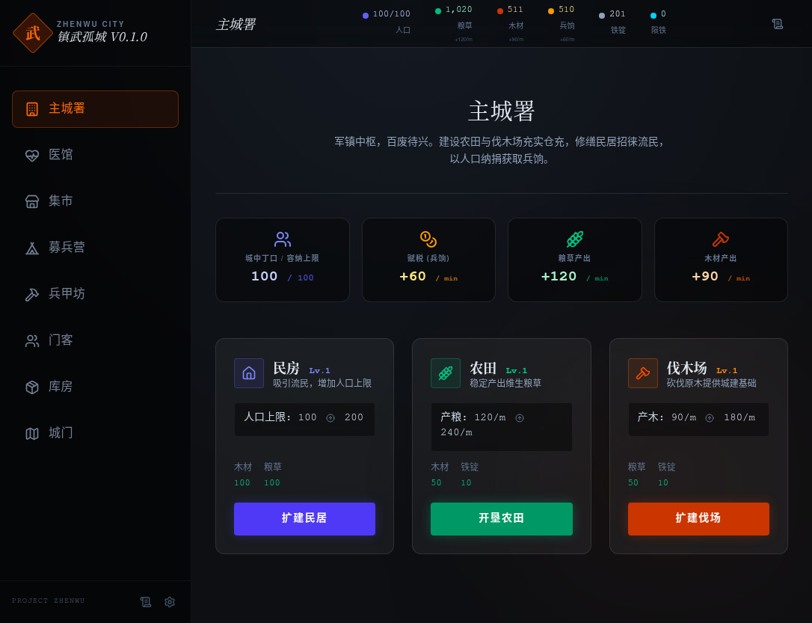

2. 打开开发者工具 → Console 面板，观察到多个 Google Fonts 请求失败

3. 打开 Network 面板，筛选 Font 类型，可见 4 个字体家族请求均返回失败
   

---

### ISSUE-002: 资源栏显示异常资源名「脂铁」

| Field | Value |
|-------|-------|
| **Severity** | medium |
| **Category** | content / functional |
| **URL** | http://localhost:3000/ |
| **Repro Video** | N/A |

**Description**

顶部资源栏显示一个名为「脂铁」的资源项，其数值恒为 0。该名称看起来像是占位符或未完成的功能残留。在游戏语境中，「脂铁」并非标准资源名称，疑似应为「铁矿」或其他合理资源名的误写。

**Repro Steps**

1. 访问 http://localhost:3000/
   

2. 观察页面顶部资源栏，可见「脂铁」资源项显示为 0
   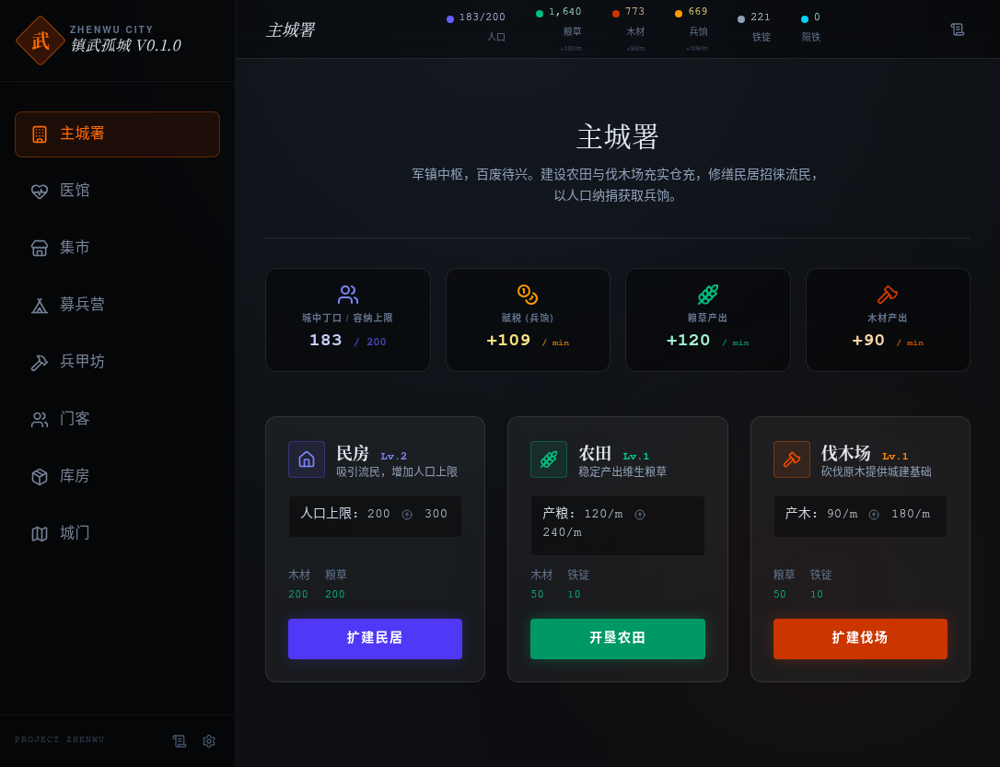

---

### ISSUE-003: 英雄详情页内容过于空旷

| Field | Value |
|-------|-------|
| **Severity** | medium |
| **Category** | ux / visual |
| **URL** | http://localhost:3000/ (英雄面板) |
| **Repro Video** | N/A |

**Description**

点击英雄进入详情页后，页面右侧约 60% 区域完全空白，仅显示基础属性信息。缺少装备预览、技能介绍、背景故事等补充内容，用户体验较为空洞。

**Repro Steps**

1. 访问 http://localhost:3000/
2. 点击导航中的「客栈/英雄」入口
   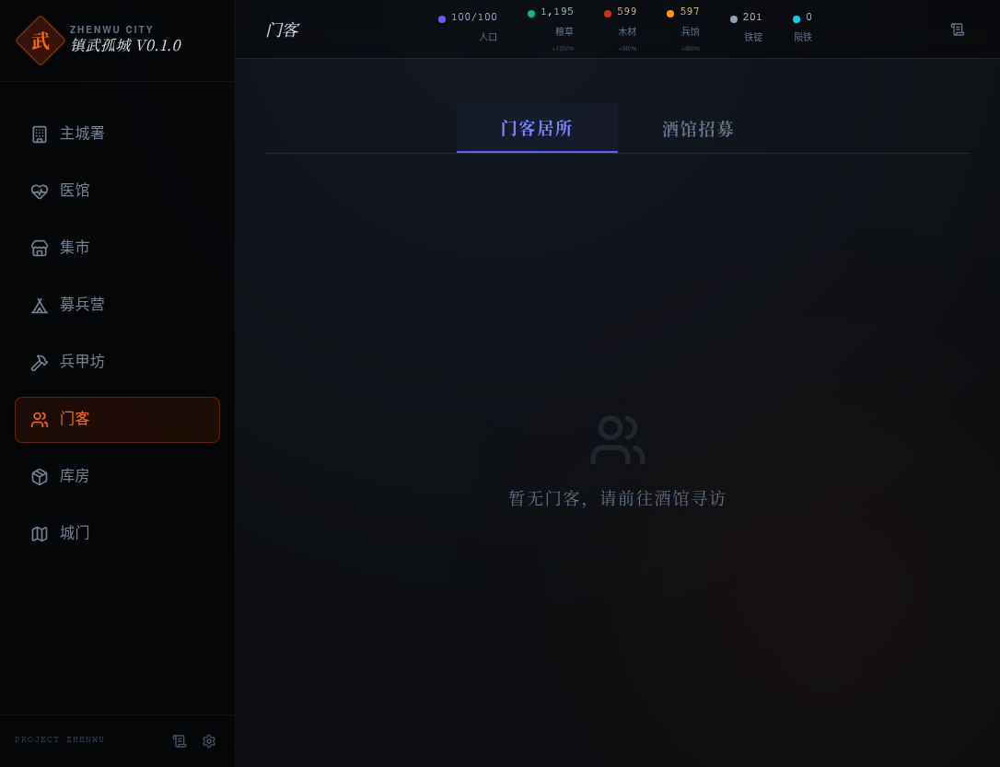

3. 点击任意一个英雄头像查看详情
   

4. **观察：** 详情页右侧大面积空白，信息密度过低
   

---

### ISSUE-004: 禁用按钮无提示信息

| Field | Value |
|-------|-------|
| **Severity** | medium |
| **Category** | ux |
| **URL** | http://localhost:3000/ (集市、兵甲坊) |
| **Repro Video** | N/A |

**Description**

集市和兵甲坊面板中存在多个置灰禁用状态的按钮，但鼠标悬停时没有任何提示信息（tooltip 或文字说明）。用户无法得知这些功能为何不可用以及如何解锁。

**Repro Steps**

1. 访问 http://localhost:3000/
2. 点击「集市」导航项
   

3. 将鼠标悬停在禁用按钮上，**观察：** 无任何 tooltip 或提示文本出现
   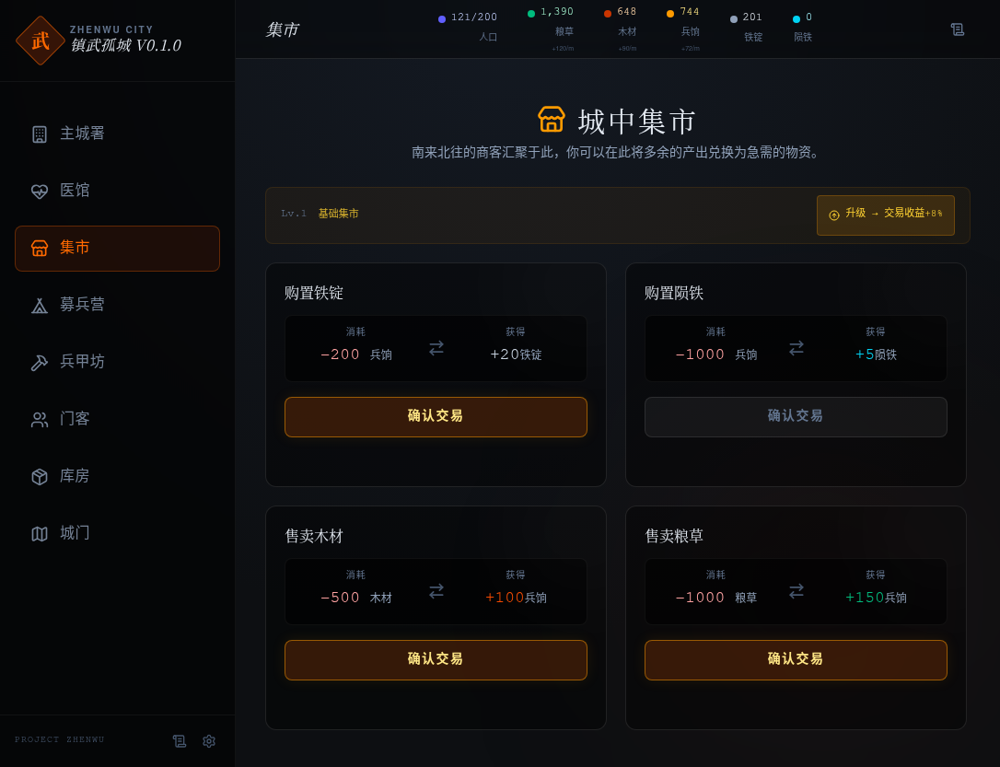

4. 切换到「兵甲坊」，同样悬停禁用按钮
   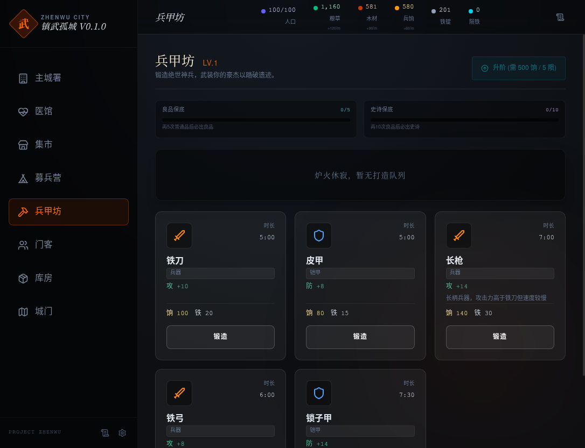

5. **观察：** 同样无任何提示信息
   

---

### ISSUE-005: 公告弹窗日期格式截断

| Field | Value |
|-------|-------|
| **Severity** | low |
| **Category** | visual / content |
| **URL** | http://localhost:3000/ (公告板) |
| **Repro Video** | N/A |

**Description**

更新公告弹窗中的日期文字显示不完整，末尾字符被截断。日期区域宽度不足以容纳完整的日期字符串。

**Repro Steps**

1. 访问 http://localhost:3000/
2. 点击公告板图标打开更新公告
   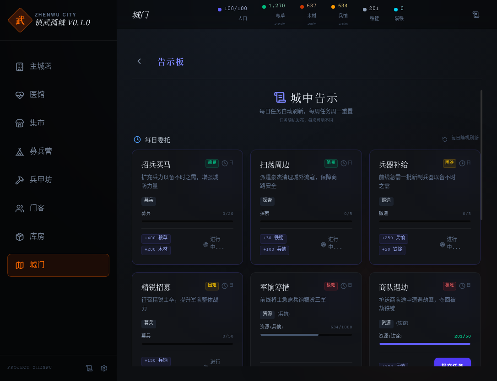

3. **观察：** 弹窗内日期文字被截断
   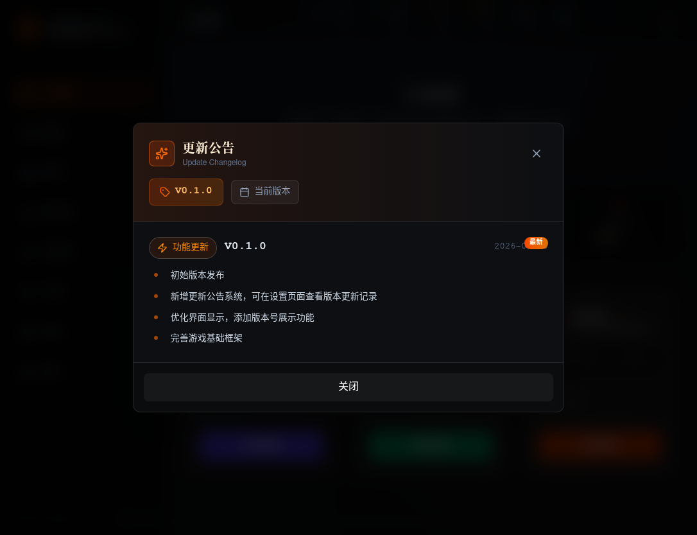

---

### ISSUE-006: 医院面板文字对比度偏低

| Field | Value |
|-------|-------|
| **Severity** | low |
| **Category** | accessibility / visual |
| **URL** | http://localhost:3000/ (医院) |
| **Repro Video** | N/A |

**Description**

医院面板中的次要文字颜色过浅，与背景色的对比度低于 WCAG AA 标准（4.5:1），长时间阅读可能造成视觉疲劳。

**Repro Steps**

1. 访问 http://localhost:3000/
2. 点击「医院」导航项
   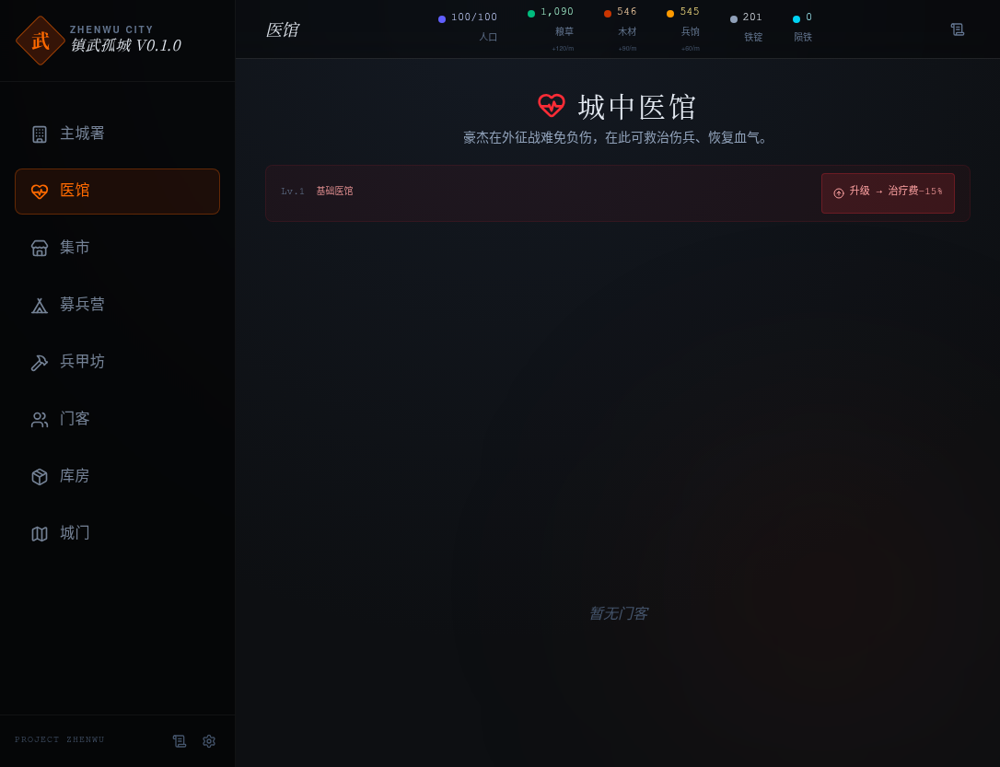

3. **观察：** 面板内描述性文字颜色偏淡，对比度不足
   

---

### ISSUE-007: 城门远征界面文字格式不一致

| Field | Value |
|-------|-------|
| **Severity** | low |
| **Category** | visual / content |
| **URL** | http://localhost:3000/ (城门-远征) |
| **Repro Video** | N/A |

**Description**

城门远征视图中，部分任务描述使用全角标点，部分使用半角标点；数字与单位之间有时有空格有时没有。整体排版缺乏统一规范。

**Repro Steps**

1. 访问 http://localhost:3000/
2. 点击「城门」导航
   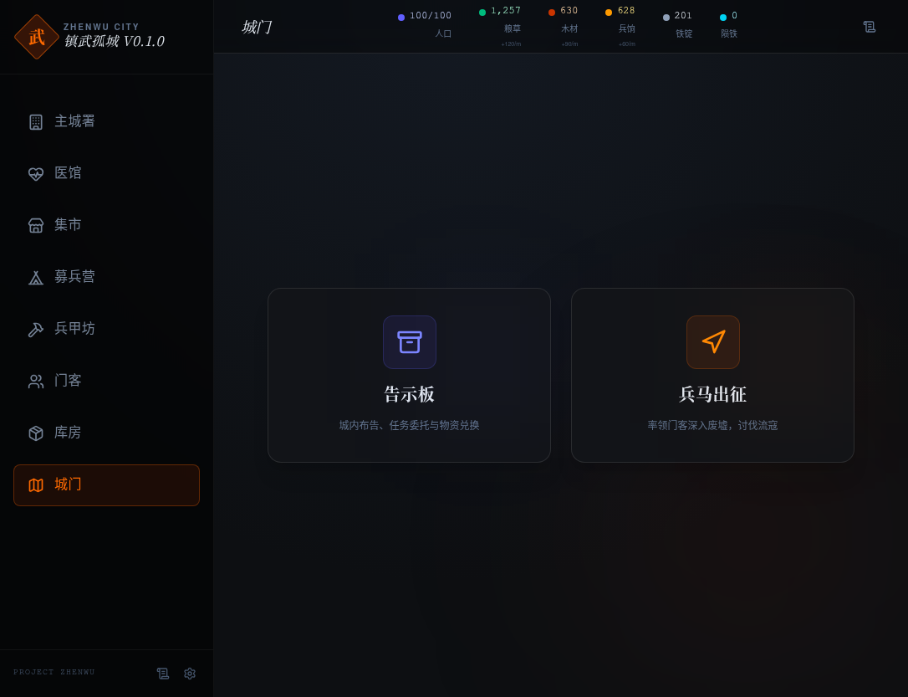

3. 进入远征视图
   

4. **观察：** 任务列表中标点和空格使用不一致
   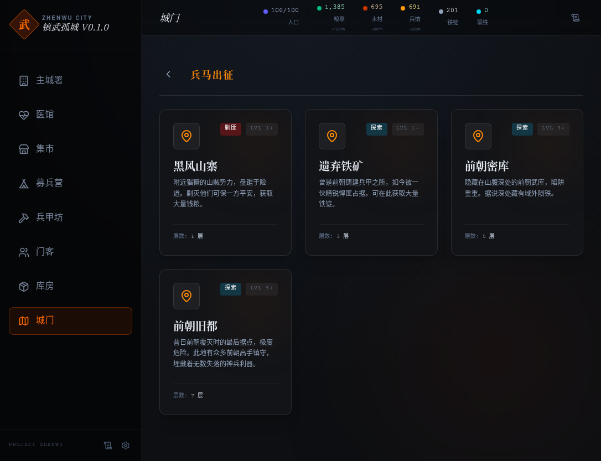

---

### ISSUE-008: 仓库面板缺少操作引导

| Field | Value |
|-------|-------|
| **Severity** | low |
| **Category** | ux |
| **URL** | http://localhost:3000/ (仓库) |
| **Repro Video** | N/A |

**Description**

仓库面板仅展示当前存储的资源列表，但没有说明资源的获取途径、用途或上限。新玩家可能不清楚如何管理仓库或为何需要关注库存。

**Repro Steps**

1. 访问 http://localhost:3000/
2. 点击「仓库」导航项
   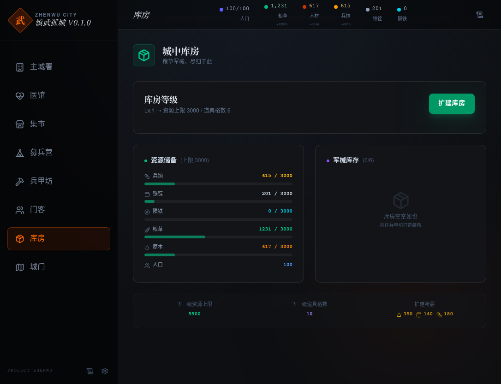

3. **观察：** 纯数据展示，无任何引导文案或帮助提示
   

---

### ISSUE-009: 招募面板缺少确认反馈

| Field | Value |
|-------|-------|
| **Severity** | low |
| **Category** | ux / functional |
| **URL** | http://localhost:3000/ (招募) |
| **Repro Video** | N/A |

**Description**

在酒馆执行招募操作后，缺少明确的成功/失败反馈提示（如 toast 通知、动画效果或状态变化）。用户无法确认操作是否已生效。

**Repro Steps**

1. 访问 http://localhost:3000/
2. 进入「客栈」→「招募」子页面
   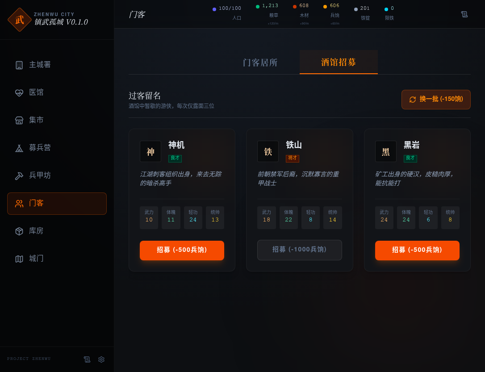

3. 执行招募操作
   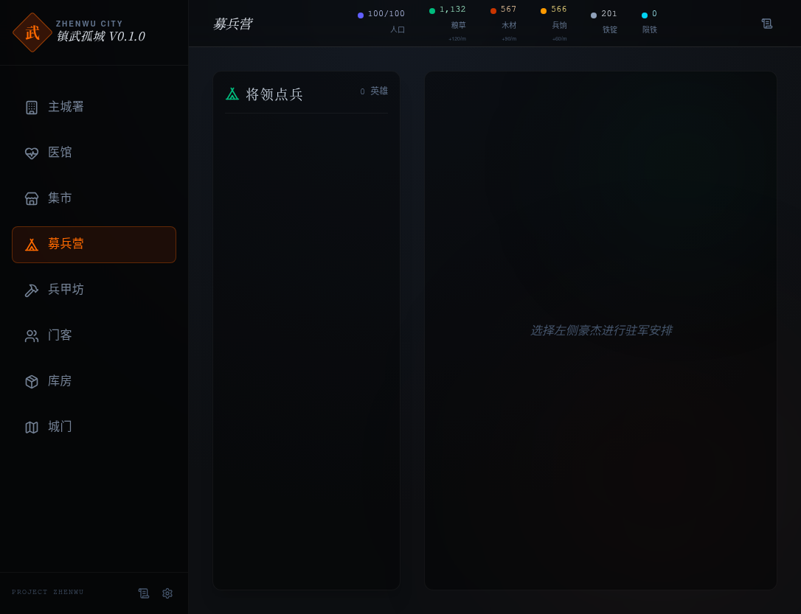

4. **观察：** 操作后无明显反馈提示
   

---

## 正常功能记录

以下功能经测试验证正常工作：

| 功能模块 | 测试结果 |
|----------|----------|
| 主城建筑升级（民房 Lv.1→Lv.2） | ✅ 正常 |
| 集市交易执行 | ✅ 正常 |
| 更新公告弹窗打开/关闭 | ✅ 正常 |
| 重置游戏进度（破釜沉舟确认弹窗） | ✅ 正常 |
| 全部导航切换 | ✅ 正常，无白屏卡顿 |
| JavaScript 运行时错误 | ✅ 无 |
